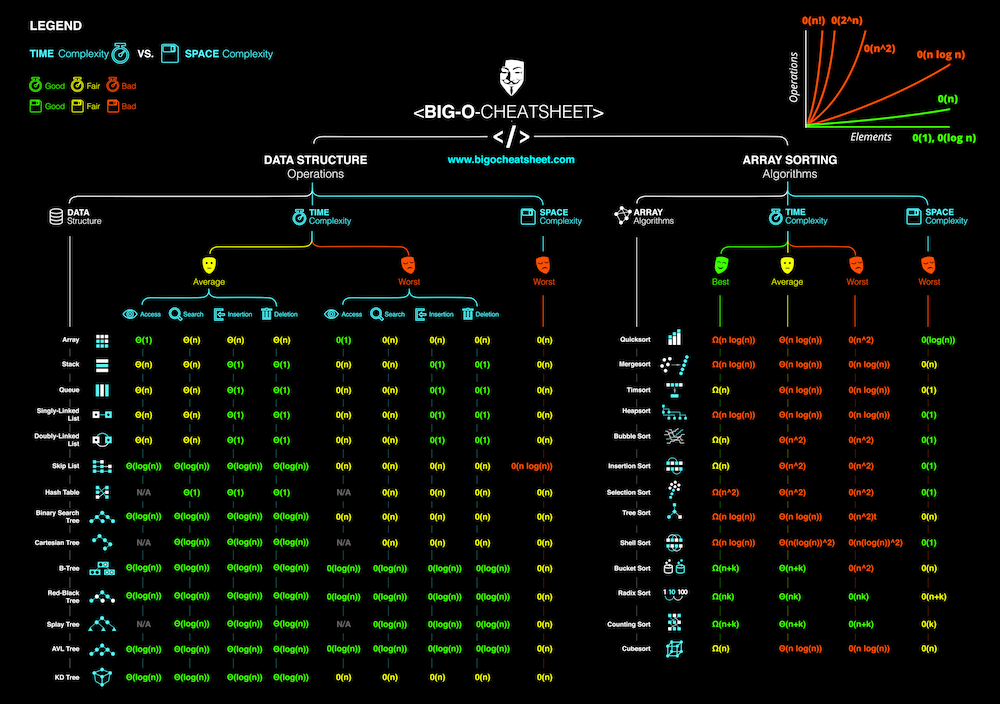

<!-- header -->

    

    <!-- Header -->
        
        <h2>data-structures-and-algorithms</h2>
        
<i>Data Structures and Algorithms in Python</i>

    

    

    <!-- Shields -->
        
        
        
        
        
        
    

    

    <!-- Links -->
        <a href="https://github.com/armckinney/data-structures-and-algorithms/issues/new/choose">Report Bug</a>
        ·
        <a href="https://github.com/armckinney/data-structures-and-algorithms/issues/new/choose">Request Feature</a>
    

 
 

<!-- Description -->
# Data Structures:
A data structure is a particular way of organizing and storing data in a computer so that it can be accessed and modified efficiently. More precisely, a data structure is a collection of data values, the relationships among them, and the functions or operations that can be applied to the data.

- Linked List
- Doubly Linked List
- Queue
- Stack
- Hash Table
- Heap
    - Min Heap
    - Max Heap
- Priority Queue
- Trie
- Tree
    - Binary Search Tree
    - AVL Tree
    - Red-Black Tree
    - Segment Tree
    - Fenwick Tree
- Graph
- Disjoint Set
- Bloom Filter
- LRU Cache 

# Algorithms:
An algorithm is an unambiguous specification of how to solve a class of problems. It is a set of rules that precisely define a sequence of operations.

- **Searches**
  - [Linear Search](src/algorithms/search/linear-search)
  - [Binary Search](src/algorithms/search/binary-search) - search in sorted array
- **Sorting**
  - [Heap Sort](src/algorithms/sorting/heap-sort)
  - [Merge Sort](src/algorithms/sorting/merge-sort)
  - [Quicksort](src/algorithms/sorting/quick-sort) - in-place and non-in-place implementations
  - [Counting Sort](src/algorithms/sorting/counting-sort)
  - [Radix Sort](src/algorithms/sorting/radix-sort)
- **Linked Lists**
  - [Straight Traversal](src/algorithms/linked-list/traversal)
  - [Reverse Traversal](src/algorithms/linked-list/reverse-traversal)
- **Trees**
  - [Depth-First Search](src/algorithms/tree/depth-first-search) (DFS)
  - [Breadth-First Search](src/algorithms/tree/breadth-first-search) (BFS)
- **Graphs**
  - [Depth-First Search](src/algorithms/graph/depth-first-search) (DFS)
  - [Breadth-First Search](src/algorithms/graph/breadth-first-search) (BFS)\
  - [Dijkstra Algorithm](src/algorithms/graph/dijkstra) - finding the shortest paths to all graph vertices from single vertex
- **Strings**
  - [Levenshtein Distance](src/algorithms/string/levenshtein-distance) - minimum edit distance between two sequences
  - [Longest Common Subsequence](src/algorithms/sets/longest-common-subsequence) (LCS)
  - [Longest Common Substring](src/algorithms/string/longest-common-substring)
  - [Longest Increasing Subsequence](src/algorithms/sets/longest-increasing-subsequence)
  - [Shortest Common Supersequence](src/algorithms/sets/shortest-common-supersequence)
  - [Maximum Subarray](src/algorithms/sets/maximum-subarray)

## Big O Notation

*Big O notation* is used to classify algorithms according to how their running time or space requirements grow as the input size grows.
On the chart below you may find most common orders of growth of algorithms specified in Big O notation.

Source: [Big O Cheat Sheet](http://bigocheatsheet.com/).

Below is the list of some of the most used Big O notations and their performance comparisons against different sizes of the input data.

| Big O Notation | Type        | Computations for 10 elements | Computations for 100 elements | Computations for 1000 elements  |
| -------------- | ----------- | ---------------------------- | ----------------------------- | ------------------------------- |
| **O(1)**       | Constant    | 1                            | 1                             | 1                               |
| **O(log N)**   | Logarithmic | 3                            | 6                             | 9                               |
| **O(N)**       | Linear      | 10                           | 100                           | 1000                            |
| **O(N log N)** | n log(n)    | 30                           | 600                           | 9000                            |
| **O(N^2)**     | Quadratic   | 100                          | 10000                         | 1000000                         |
| **O(2^N)**     | Exponential | 1024                         | 1.26e+29                      | 1.07e+301                       |
| **O(N!)**      | Factorial   | 3628800                      | 9.3e+157                      | 4.02e+2567                      |

