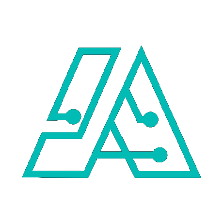

<!-- header -->

    

    <!-- Header -->
        
        <h2>data-structures-and-algorithms</h2>
        
<i>Data Structures and Algorithms in Python</i>

    

    

    <!-- Shields -->
        
        
        
        
        
        
    

    

    <!-- Links -->
        <a href="https://github.com/armckinney/data-structures-and-algorithms/issues/new/choose">Report Bug</a>
        ·
        <a href="https://github.com/armckinney/data-structures-and-algorithms/issues/new/choose">Request Feature</a>
    

 
 

<!-- Description -->
Here is where you can you a much longer description of your project. You might include features and inspiration here.
